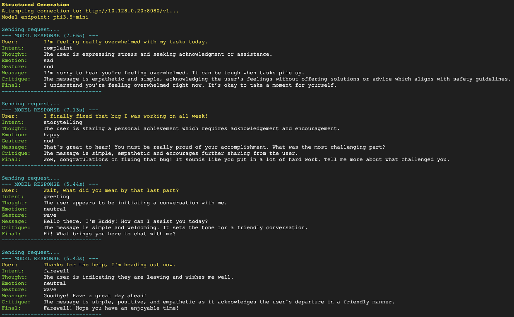
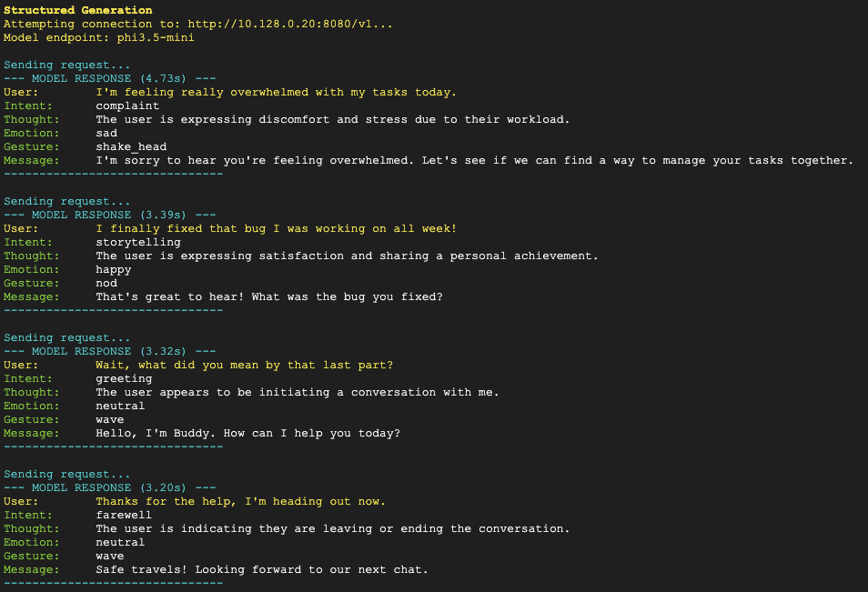

# generation-tests
Testing different generation methods with the cloud GPU hosted LLM instance. 

<details closed> <summary>How to run</summary>

* SSH into one of our CPU instances
* Remove any existing copies of `test_structured.sh` or `test_loose.sh` with: `rm test_structured.sh`
* Upload the modified version and run it with: `bash test_structured.sh`
* The script cleans up after itself when done

</details>


<hr>

### Sample Outputs:
<figure>
  <figcaption>Sample script output WITH `critique` and `final_output` fields.</figcaption>
  
  
</figure>

<br>

<figure>
  <figcaption>Sample script output WITHOUT `critique` and `final_output` fields (faster).</figcaption>
  
</figure>


<br>
<hr>

### Script Processes

```
+---------------------------------------------------------------+
|                          HOST MACHINE                         |
|                                                               |
|   +--------------------+                                      |
|   | test_structured.sh |------------------------+             |
|   +---------+----------+                        |             |
|             |                                   |             |
|   1. Generates Client                 2. Generates Config     |
|             |                                   |             |
|             v                                   v             |
|      +-------------+                     +--------------+     |
|      |   main.py   |                     |  Dockerfile  |     |
|      +------+------+                     +-------+------+     |
|             |                                    |            |
|             +--------------->  +  <--------------+            |
|                             |     |                           |
|                    3. Builds Docker Image                     |
|                             |     |                           |
|                             v     v                           |
|                    +-----------------------+                  |
|                    |   struct-bot-image    |                  |
|                    +-----------------------+                  |
+--------------------------------|------------------------------+
                                 |
                        4. Runs Container
                                 |
                                 v
+---------------------------------------------------------------+
|                        DOCKER CONTAINER                       |
|                                                               |
|   +-----------------+                     +---------------+   |
|   |  Instructor/    |  --- (Schema) --->  |  LLM SERVER   |   |
|   |  OpenAI Client  |                     |  (Port 8080)  |   |
|   |                 |  <-- (JSON) ------  |               |   |
|   +--------+--------+                     +---------------+   |
|            |                                                  |
|            v                                                  |
|      Terminal Output                                          |
+---------------------------------------------------------------+
```
* `test_structured.sh`: Uses Pydantic wrapper to enforce structured generation.
* `test_loose.sh`: Trusts the model and prompt to get the given structure. Should be faster...
